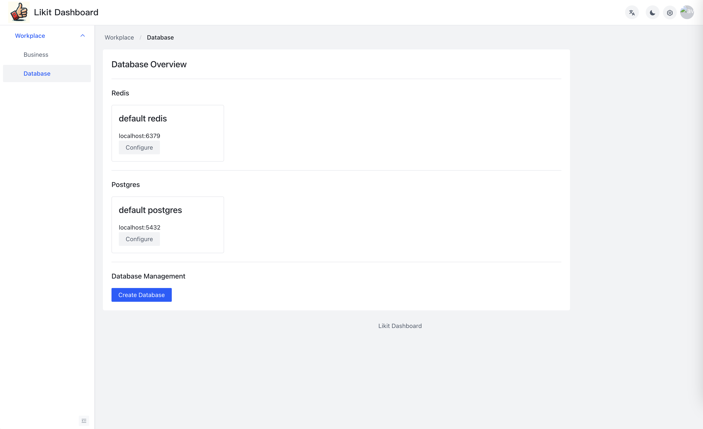

<p align="center">
    </a>
</p>

# Likit

[Demo](https://likit.zeabur.app)

[English](./README.md) | 简体中文

## What is Likit
Likit 是一个 Backend as a Service ，提供点赞（投票、点赞、计数）功能。 部署和使用非常容易。

Likit的目标是帮助您在10分钟内实现类似的功能。

Likit 适用于中小型应用程序。 您可以选择差异投票工具引擎来获得不同的功能和性能。
[Getting started](./docs/getting-started.md)

| features | Simple Vote System | Middle Vote System(WIP) |
| -- | -- | -- |
| Vote | ✅ |  🚧 |
| Unvote | ✅ |  🚧 |
| Count | ✅ | 🚧 |
| List the voted users | ✅ | 🚧 | 
| is Voted | ✅ | 🚧 | 
| vote events | ❌ | 🚧 |
| message queue | ❌ | ❌ | 
| requires | redis |  redis,postgres |

# Screenshots




# Deployment

## Zeabur
Deloyment on Zeabur by one click

[](https://zeabur.com/templates/KZOLHA?referralCode=CorrectRoadH)

## Docker Compose
```
wget https://raw.githubusercontent.com/CorrectRoadH/Likit/main/docker-compose.yaml

docker compose up -d
```

## K8S
Coming soon

# Documentation
[Document](./docs/getting-started.md)

## RESTful API

### Vote
POST `http(s)://<your likit ip>/api/v1/vote`

body

```
{
    "businessId": "businessId",
    "messageId": "messageId",
    "userId": "userId"
}
```

POST `http(s)://<your likit ip>/api/v1/unvote`

body

### Unvote
```
{
    "businessId": "businessId",
    "messageId": "messageId",
    "userId": "userId"
}
```

### Count the number of votes
GET `http(s)://<your likit ip>/api/v1/count/:businessId/:messageId`

### List the users who voted
GET `http(s)://<your likit ip>/api/v1/list/:businessId/:messageId`

### Check if the user has voted
GET `http(s)://<your likit ip>/api/v1/isVoted/:businessId/:messageId/:userId`


## gRPC API
Coming soon

## SDK

### Golang
[Likit Go](https://github.com/CorrectRoadH/likit-go)

### Java
Coming soon
