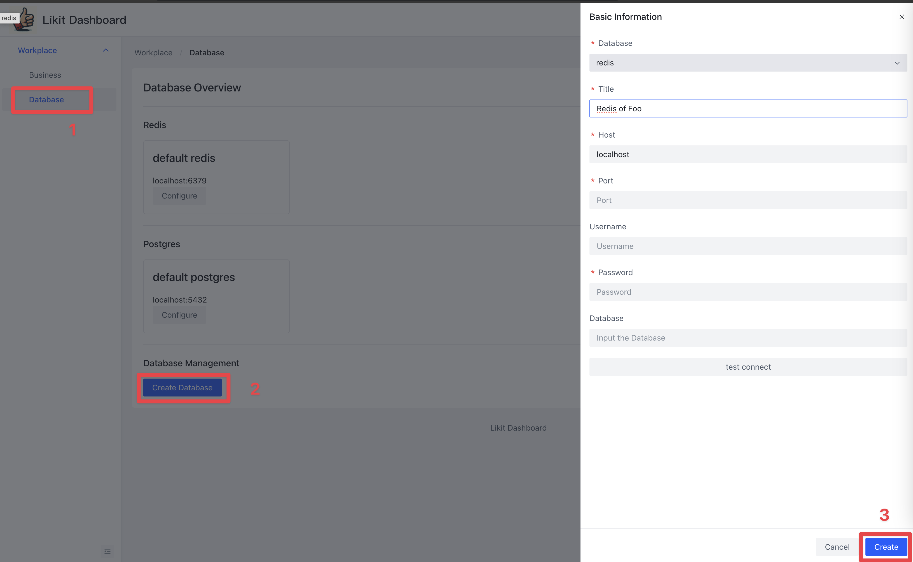
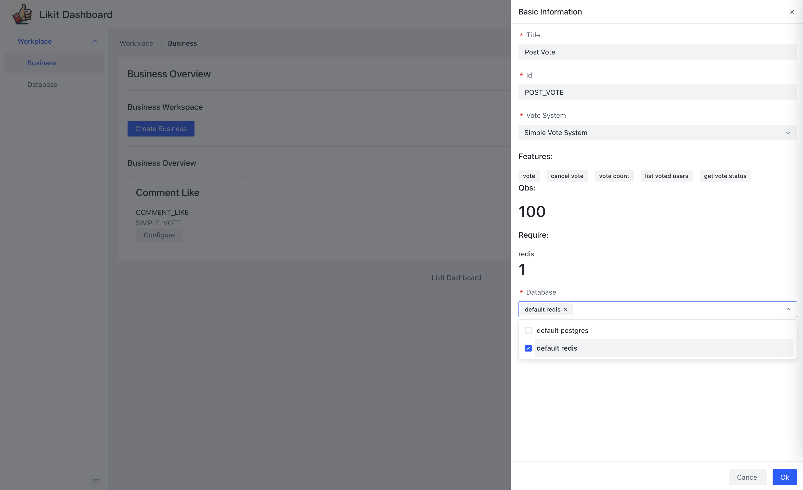

## What is Likit
WIP

## Getting started
Likit is very easy to embed in your backend. You just need to deploy it and create the business Id for your business. Then you can use it in your backend.

### Deployment

#### zeabur
Deloyment on Zeabur by one click

[](https://zeabur.com/templates/KZOLHA?referralCode=CorrectRoadH)


#### docker-compose
```
wget https://raw.githubusercontent.com/CorrectRoadH/Likit/main/docker-compose.yaml

docker compose up -d
```

### Create Business
1. create database connection if you want use extra database
 


1. create business by click the button `Create Business` on the top right corner.



Input the business title and id

### Implement the logic in your backend
Copy business id and use it in your backend.
Message id mean the id of object that be vote, The message id can be any string. It is decided by your business logic.

#### Golang 
[Click here](https://github.com/CorrectRoadH/likit-go/blob/main/README.md)

#### Java
WIP

#### RESTful API
WIP

#### gRPC
WIP
